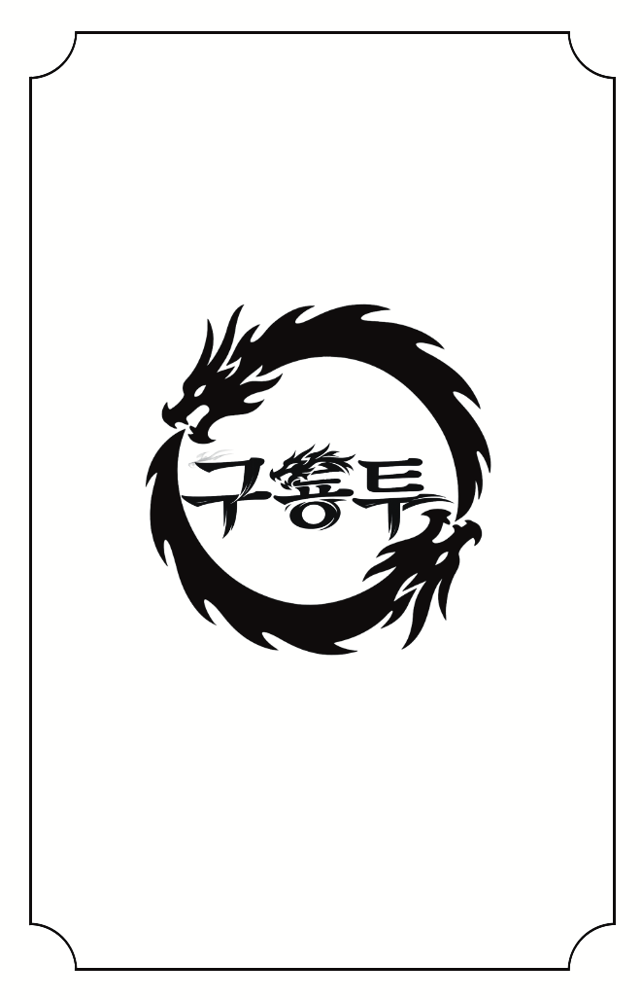

<p align="center">
  
</p>


# 구룡투 (9 Dragon Battle)

> ⚠️ 본 프로젝트는 코리아보드게임즈의 「구룡투」를 기반으로 제작된 비공식 팬 프로젝트입니다.

"구룡투 확장: 도전의 길"에서 제공하는 것과 같은 "구룡투 프로모: 카드 게임"과 같은 실물 카드에 QR코드를 부착한 후,
이러한 QR 코드를 스캔하여 승패 판정과 점수 관리를 수행하는 모바일 웹앱입니다.

카드 사용 여부, 라운드 결과, 점수 계산, 최종 승리 판정을 자동으로 처리하여 게임 진행을 보조합니다.

## 플레이하기

🌐 https://april4ys.github.io/9-dragon-battle/

모바일 브라우저 사용을 권장합니다.

카메라 권한이 필요합니다.

---

## 주요 기능

* QR 코드 스캔
* 자동 승패 판정
* 점수 자동 집계
* 사용 카드 재사용 방지
* 라운드 기록 표시
* 최종 승리 자동 판정
* 모바일 최적화 UI
* GitHub Pages 배포

---

## 게임 규칙

### 카드 구성

각 진영은 다음 카드를 사용합니다.

* A1 ~ A9
* B1 ~ B9

각 카드는 한 게임에서 한 번만 사용할 수 있습니다.

---

### 승패 규칙

기본 규칙

* 숫자가 큰 쪽이 승리
* 같은 숫자는 무승부

예외 규칙

* 1은 9를 이김

예시

```text
A7 vs B5 → A 승리
A5 vs B5 → 무승부
A1 vs B9 → A 승리
```

---

### 게임 종료 조건

다음 조건 중 하나를 만족하면 즉시 게임 종료

#### 1. 누적 5승 달성

```text
A 5 : 2 B
→ A 최종 승리
```

#### 2. 역전 불가능 상태

남은 라운드를 모두 승리해도 상대를 따라잡을 수 없는 경우

```text
무승부 2회
A 4 : 0 B

남은 라운드 3개

→ A 최종 승리
```

#### 3. 9라운드 종료

9라운드 종료 시 승수가 높은 진영이 승리

```text
A 3 : 2 B
→ A 최종 승리
```

승수가 같으면

```text
A 2 : 2 B
→ 최종 무승부
```

---

## 개발 환경

### Frontend

* React 19
* TypeScript
* Vite 7

### QR Recognition

* qr-scanner

### UI

* Lucide React

### Testing

* Vitest

### Deployment

* GitHub Pages
* GitHub Actions

---

## 로컬 실행

```bash
npm install
npm run dev
```

HTTPS 환경 실행

```bash
npm run dev:https
```

iPhone Safari 테스트 시 HTTPS 환경 사용을 권장합니다.

---

## 개발 배경

구룡투를 플레이하면서 QR 코드를 활용해 카드 정보를 인식하고 승패 판정을 자동화할 수 있는지 실험하기 위해 제작한 개인 프로젝트입니다.

실물 카드 게임의 플레이 경험을 유지하면서 게임 진행을 보조하는 도구를 목표로 개발되었습니다.

여기서 실물 카드란, "구룡투 확장: 도전의 길"에서 제공하는 것과 같은 "구룡투 프로모: 카드 게임"에 QR코드를 별도로 부착한 것을 말합니다.

---

## 면책 고지

본 프로젝트는 코리아보드게임즈의 보드게임 **구룡투**를 기반으로 제작된 비공식 팬 프로젝트입니다.

구룡투 및 관련 명칭, 규칙, 디자인 등의 권리는 원저작권자 및 권리자에게 있습니다.

본 프로젝트는 상업적 목적 없이 개인 학습 및 취미 목적으로 개발되었으며, 원저작권자의 권리를 침해할 의도가 없습니다.

본 프로젝트는 코리아보드게임즈와 어떠한 공식적인 관계도 없습니다.

권리자의 요청이 있을 경우 저장소 공개 중단 또는 삭제에 협조하겠습니다.

---

## License

This repository is provided for personal and educational purposes only.

All rights to the original game and its intellectual property belong to their respective owners.
